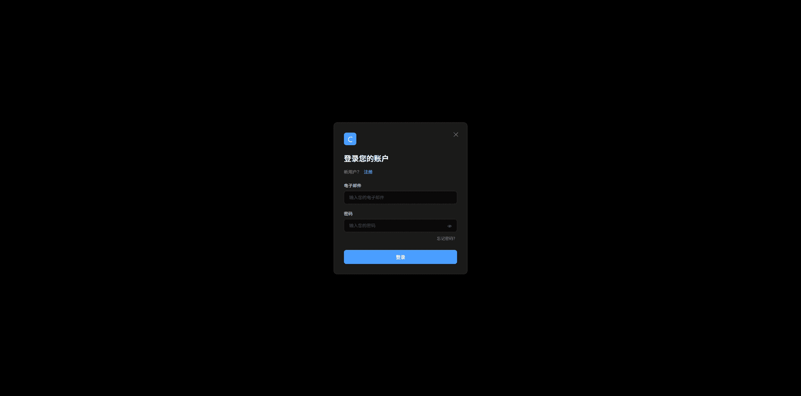
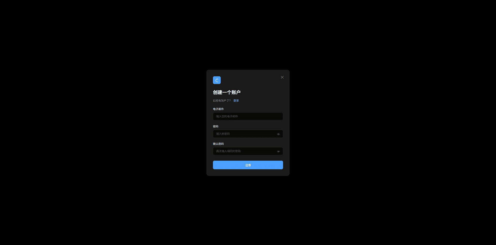
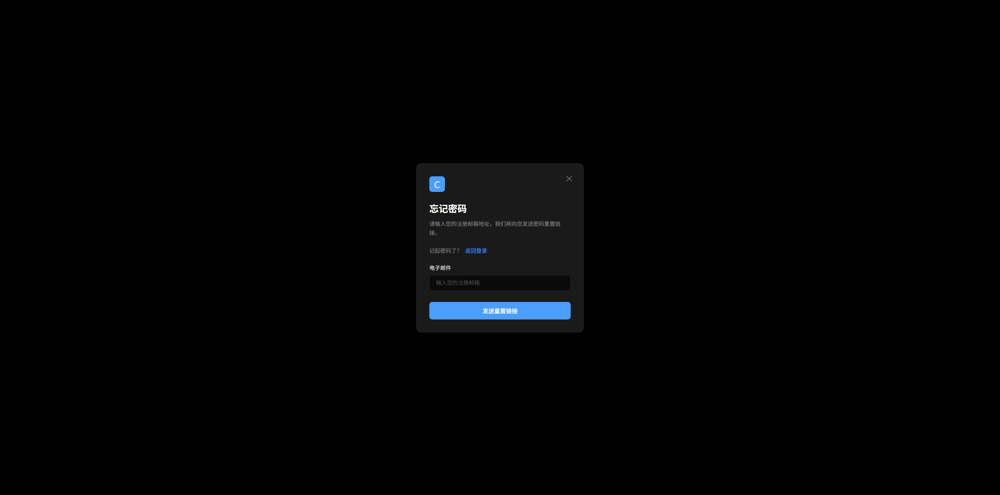
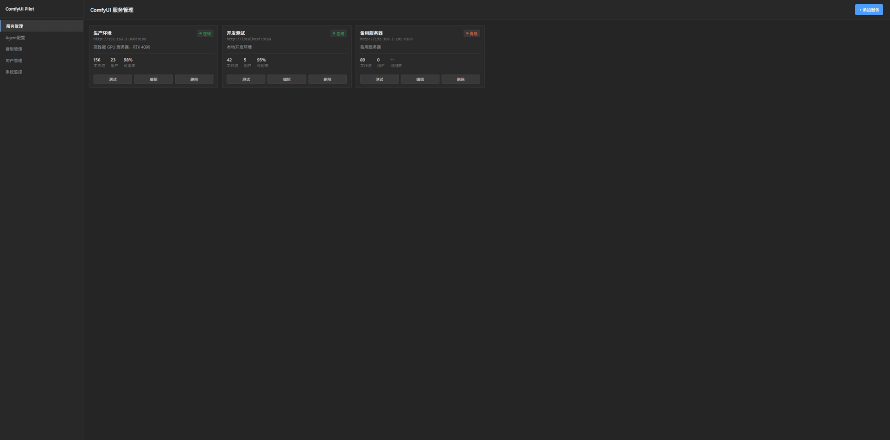
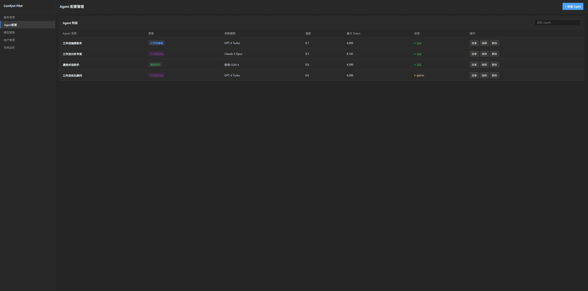
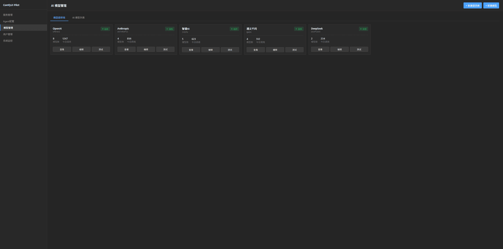
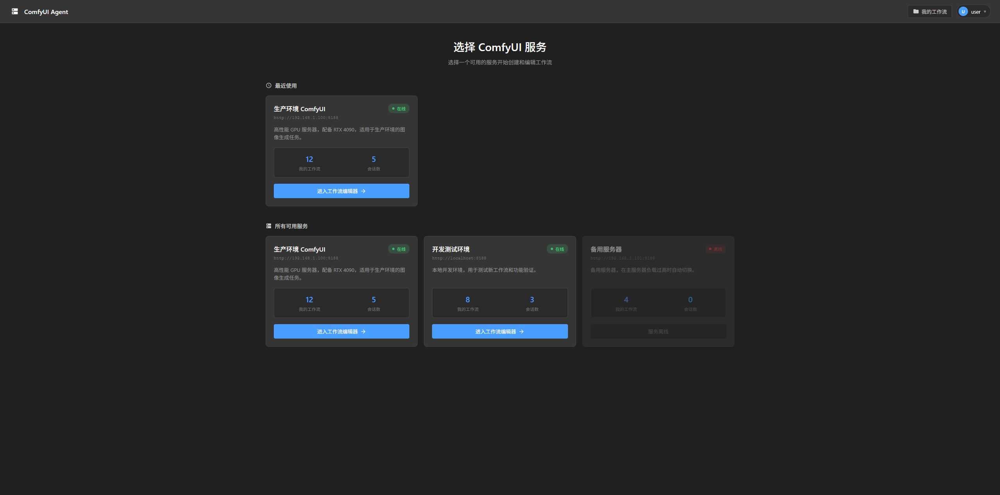
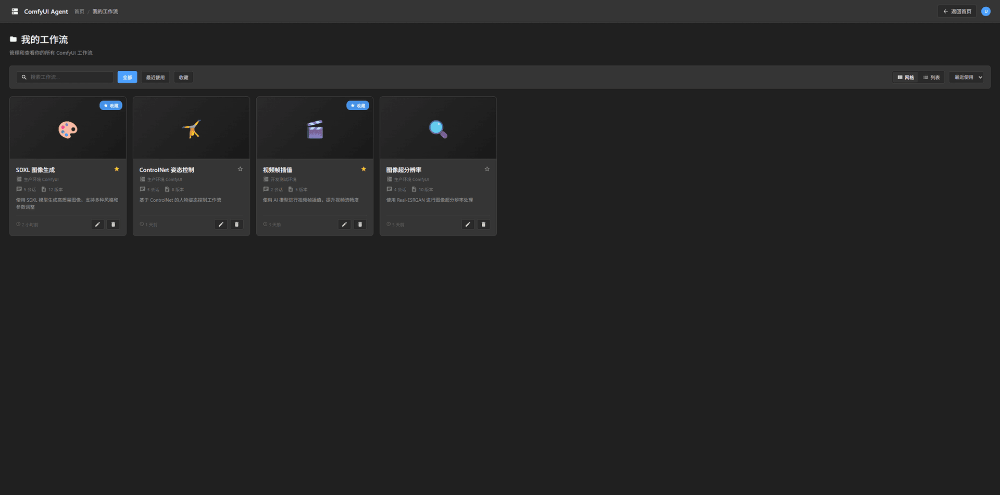
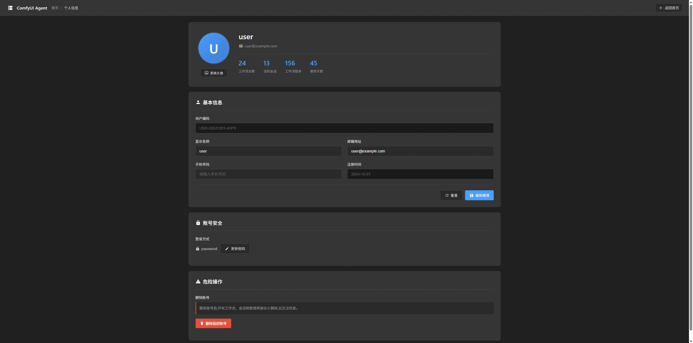
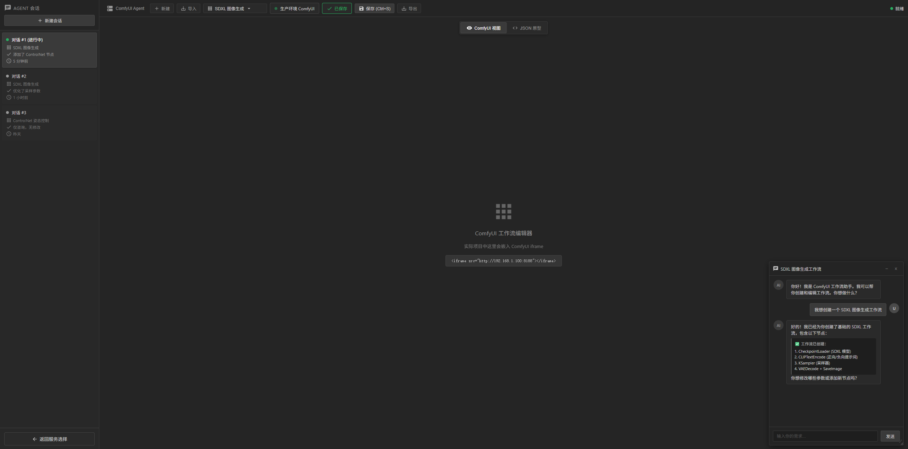

# ComfyUI Agent 代理系统 - 原型设计文档

## 📋 系统概述

本系统作为 ComfyUI 的代理层，统一管理多个 ComfyUI 服务实例，为用户提供增强的 AI Agent 辅助功能。

## 🎯 核心设计理念

### 1. 多对多关系模型

```
ComfyUI 服务 ←→ 工作流 ←→ Chat Agent Session
     (1)           (N)            (M)
```

- **ComfyUI 服务**：可以有多个工作流
- **工作流**：可以有多个 Chat Session

### 2. 用户角色设计

#### 管理员用户
- 管理 ComfyUI 服务实例（增删改查）
- 查看服务状态和监控
- 管理用户权限（先完成其他的功能）

#### 普通用户
- 选择可用的 ComfyUI 服务
- 创建和编辑工作流
- 使用 AI Agent 辅助功能
- 管理自己的 Chat Session

### 3. 技术架构

#### 前端架构
```
┌─────────────────────────────────────────┐
│         用户界面层                        │
│  ┌──────────┐  ┌──────────┐  ┌────────┐ │
│  │ 登录页面  │  │ 服务选择  │  │ 管理后台│ │
│  └──────────┘  └──────────┘  └────────┘ │
└─────────────────────────────────────────┘
                    ↓
┌─────────────────────────────────────────┐
│         工作流编辑层                      │
│  ┌──────────────────────────────────┐   │
│  │  Session 管理 │ ComfyUI iframe   │   │
│  │  (左侧边栏)   │  (中间主区域)     │   │
│  │               │                  │   │
│  │               │  ┌─────────────┐ │   │
│  │               │  │ 悬浮聊天框   │ │   │
│  │               │  │ (可调整)     │ │   │
│  │               │  └─────────────┘ │   │
│  └──────────────────────────────────┘   │
└─────────────────────────────────────────┘
                    ↓
┌─────────────────────────────────────────┐
│         通信层                           │
│  ┌──────────┐  ┌──────────┐            │
│  │ postMessage│  │ WebSocket│            │
│  │ (iframe)  │  │ (Agent)  │            │
│  └──────────┘  └──────────┘            │
└─────────────────────────────────────────┘
```

#### iframe 通信机制
```javascript
// 父页面 → ComfyUI iframe
window.frames['comfyui'].postMessage({
  type: 'LOCK_WORKFLOW',
  payload: { reason: 'Agent editing' }
}, '*');

// ComfyUI iframe → 父页面
window.parent.postMessage({
  type: 'WORKFLOW_CHANGED',
  payload: { workflow: {...} }
}, '*');
```

## 📄 页面列表

### 01 系列 - 认证相关页面

#### 01-login-ui.html - 登录页面



- **功能**: 用户登录系统
- **主要元素**:
  - 电子邮件输入框
  - 密码输入框(带显示/隐藏切换)
  - 登录按钮
  - 注册链接
  - 忘记密码链接
- **设计风格**: 深色主题,居中模态框设计,ComfyUI风格

#### 01-register-ui.html - 注册页面



- **功能**: 新用户注册账户
- **主要元素**:
  - 电子邮件输入框
  - 密码输入框(带显示/隐藏切换)
  - 确认密码输入框(带显示/隐藏切换)
  - 注册按钮
  - 登录链接
- **验证规则**: 密码最少8个字符,两次密码必须一致
- **设计风格**: 深色主题,居中模态框设计,ComfyUI风格

#### 01-forgot-password-ui.html - 忘记密码页面



- **功能**: 用户请求重置密码
- **主要元素**:
  - 电子邮件输入框
  - 发送重置链接按钮
  - 返回登录链接
- **流程**: 输入邮箱 → 发送重置链接到邮箱
- **设计风格**: 深色主题,居中模态框设计,ComfyUI风格

#### 01-reset-password-ui.html - 重置密码页面


- **功能**: 通过邮件链接重置密码
- **主要元素**:
  - 新密码输入框(带显示/隐藏切换)
  - 确认新密码输入框(带显示/隐藏切换)
  - 重置密码按钮
- **验证规则**: 密码最少8个字符,两次密码必须一致
- **设计风格**: 深色主题,居中模态框设计,ComfyUI风格

### 02 系列 - 管理员后台页面

#### 02-admin-service-management.html - 服务管理页面



- **功能**: 管理员管理ComfyUI服务实例
- **主要元素**:
  - 左侧导航栏(服务管理/Agent配置/模型管理/用户管理/系统监控)
  - 添加服务按钮
  - 服务卡片网格展示
  - 服务状态显示(在线/离线)
  - 服务统计信息(工作流数/活跃用户等)
  - 编辑/删除/测试连接操作按钮
- **设计风格**: ComfyUI深色主题,侧边栏+主内容区布局

#### 02-admin-agent-management.html - Agent配置管理页面



- **功能**: 管理员配置AI Agent
- **主要元素**:
  - 左侧导航栏
  - 新建Agent按钮
  - Agent列表表格
  - Agent类型标签(编辑/分析/通用)
  - Agent状态(激活/维护中)
  - 搜索功能
  - 编辑/删除/配置操作按钮
- **设计风格**: ComfyUI深色主题,表格布局

#### 02-admin-model-management.html - 模型管理页面



- **功能**: 管理员管理AI模型和提供商
- **主要元素**:
  - 左侧导航栏
  - 标签页切换(提供商/模型列表)
  - 新建提供商/新建模型按钮
  - 提供商卡片网格展示
  - 模型列表表格
  - 模型类型标签(LLM/Embedding)
  - 搜索和筛选功能
- **设计风格**: ComfyUI深色主题,卡片+表格混合布局

### 03 系列 - 普通用户页面

#### 03-user-service-selection-ui.html - 服务选择页面



- **功能**: 用户选择可用的ComfyUI服务
- **主要元素**:
  - 顶部导航栏(Logo/我的工作流按钮/用户菜单)
  - 服务卡片网格展示
  - 服务状态显示(在线/离线)
  - 服务描述和统计信息
  - 选择服务按钮
- **设计风格**: ComfyUI深色主题,卡片网格布局

#### 03-1-user-workflows-ui.html - 我的工作流页面



- **功能**: 用户查看和管理自己的工作流
- **主要元素**:
  - 顶部导航栏(带面包屑导航)
  - 搜索和筛选功能
  - 排序选项
  - 工作流卡片网格展示
  - 工作流缩略图
  - 工作流名称/服务/更新时间
  - 打开/编辑/删除操作按钮
- **设计风格**: ComfyUI深色主题,卡片网格布局

#### 03-2-user-profile-ui.html - 个人信息页面



- **功能**: 用户查看和编辑个人信息
- **主要元素**:
  - 顶部导航栏(带面包屑导航)
  - 个人信息编辑表单(头像/用户名/邮箱等)
  - 修改密码功能
  - 使用统计信息
  - 保存按钮
- **设计风格**: ComfyUI深色主题,表单布局

### 04 系列 - 工作流编辑器

#### 04-workflow-editor-integrated-ui.html - 工作流编辑器集成页面



- **功能**: 核心工作流编辑界面,集成ComfyUI和AI Agent
- **主要元素**:
  - 左侧会话管理侧边栏
    - 新建会话按钮
    - 会话列表(显示会话标题/时间/消息数)
    - 会话切换功能
  - 中间ComfyUI iframe区域
    - 嵌入完整的ComfyUI编辑器
    - 工作流可视化编辑
    - 节点拖拽和连接
  - 顶部工具栏
    - 工作流选择下拉菜单
    - 保存/另存为按钮
    - 未保存修改提示
    - 运行/停止按钮
  - 右下角悬浮聊天框
    - AI Agent对话界面
    - 消息历史记录
    - 输入框和发送按钮
    - 可拖拽调整大小和位置
- **交互特性**:
  - iframe通信机制(父页面与ComfyUI双向通信)
  - 工作流锁定/解锁(Agent编辑时)
  - 实时保存状态提示
  - 会话与工作流版本关联
- **设计风格**: ComfyUI深色主题,三栏布局(侧边栏+主编辑区+悬浮聊天)

## 🔄 用户流程

### 管理员流程

#### 流程 1: 服务管理
```
登录(01-login-ui.html)
  ↓
管理后台(02-admin-service-management.html)
  ↓
点击"添加服务"按钮
  ↓
填写服务信息(名称/URL/描述)
  ↓
保存服务
  ↓
查看服务状态(在线/离线)
```

#### 流程 2: Agent配置管理
```
管理后台 → Agent配置页面(02-admin-agent-management.html)
  ↓
点击"新建Agent"按钮
  ↓
配置Agent信息(名称/类型/提示词/模型)
  ↓
保存Agent配置
  ↓
查看Agent列表和状态
```

#### 流程 3: 模型管理
```
管理后台 → 模型管理页面(02-admin-model-management.html)
  ↓
切换标签页(提供商/模型列表)
  ↓
新建提供商或新建模型
  ↓
配置模型信息(名称/类型/API密钥)
  ↓
保存并测试连接
```

### 普通用户流程

#### 流程 1: 新用户首次使用
```
注册(01-register-ui.html)
  ↓
登录(01-login-ui.html)
  ↓
服务选择页(03-user-service-selection-ui.html)
  ↓
选择一个可用的ComfyUI服务
  ↓
工作流编辑器(04-workflow-editor-integrated-ui.html)
  ↓
自动创建新的未保存工作流(默认名称: Unsaved Workflow)
  ↓
与AI Agent对话或手动编辑工作流
  ↓
保存工作流(需要手动命名)
```

#### 流程 2: 查看和管理工作流
```
服务选择页(03-user-service-selection-ui.html)
  ↓
点击顶部"我的工作流"按钮
  ↓
工作流列表页(03-1-user-workflows-ui.html)
  ↓
[搜索/筛选/排序工作流]
  ↓
点击工作流卡片
  ↓
自动进入该工作流最后使用的服务
  ↓
工作流编辑器(04-workflow-editor-integrated-ui.html)
  ↓
加载已保存的工作流内容
```

#### 流程 3: 编辑现有工作流
```
工作流编辑器(04-workflow-editor-integrated-ui.html)
  ↓
修改工作流(手动编辑或通过Agent)
  ↓
顶部显示"未保存的修改"提示
  ↓
点击保存按钮或按Ctrl+S
  ↓
保存工作流到当前激活版本
  ↓
提示变为"已保存"
```

#### 流程 4: 切换工作流
```
工作流编辑器(04-workflow-editor-integrated-ui.html)
  ↓
点击顶部工作流选择下拉菜单
  ↓
选择另一个工作流
  ↓
[如果有未保存修改] 弹窗提示
  ↓
选择"保存"或"不保存直接切换"
  ↓
切换到新工作流
  ↓
左侧会话列表自动切换到对应工作流的历史会话
```

#### 流程 5: 使用AI Agent辅助编辑
```
工作流编辑器(04-workflow-editor-integrated-ui.html)
  ↓
左侧点击"新建会话"或选择现有会话
  ↓
右下角悬浮聊天框打开
  ↓
输入需求并发送消息
  ↓
AI Agent理解需求
  ↓
工作流自动锁定(防止编辑冲突)
  ↓
Agent通过iframe通信自动编辑工作流
  ↓
工作流自动解锁
  ↓
标记为"未保存的修改"
  ↓
用户保存工作流
```

#### 流程 6: 会话管理
```
工作流编辑器(04-workflow-editor-integrated-ui.html)
  ↓
左侧会话列表中点击历史会话
  ↓
加载该会话的消息历史
  ↓
加载该会话对应的工作流版本快照
  ↓
继续对话或查看历史记录
  ↓
[可选] 保存为新版本
```

#### 流程 7: 个人信息管理
```
任意页面(03-user-service-selection-ui.html 或其他)
  ↓
点击顶部用户头像
  ↓
下拉菜单中选择"个人信息"
  ↓
个人信息页面(03-2-user-profile-ui.html)
  ↓
[编辑信息/修改密码/查看统计]
  ↓
点击保存按钮
  ↓
保存修改成功
```

#### 流程 8: 忘记密码
```
登录页面(01-login-ui.html)
  ↓
点击"忘记密码?"链接
  ↓
忘记密码页面(01-forgot-password-ui.html)
  ↓
输入注册邮箱
  ↓
点击"发送重置链接"
  ↓
邮箱收到重置链接
  ↓
点击邮件中的链接
  ↓
重置密码页面(01-reset-password-ui.html)
  ↓
输入新密码并确认
  ↓
重置成功,返回登录页面
```
